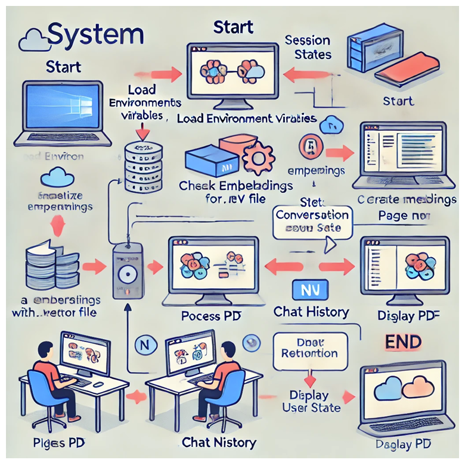

# Interactive-Reader
This is a GPT-4o-mini powered PDF reader. You can upload your pdf and ask any questions! 

This document provides an overview of the system flowchart for a Streamlit application designed for processing and interacting with PDF documents. The application utilizes the LangChain and OpenAI APIs to perform conversational retrieval of PDF content.

## System Flowchart


Illustration of the workflow of the application (generated by ChatGPT)


## Workflow Overview

1. **Start**: The application begins by loading the necessary environment variables and initializing the Streamlit session state.

2. **Load Environment Variables**: The application checks for the existence of the `.env` file, which contains API keys for OpenAI and Hugging Face. If the file is not found, an error is displayed and the application stops.

3. **Initialize Session States**: Several session state variables are initialized to manage the conversation, chat history, and current PDF page number.

4. **User Interface Layout**: The application layout is created with two columns. The first column is used for user interactions, while the second column is reserved for displaying PDF content.

5. **PDF Upload**: Users can upload a PDF document through the interface. Once uploaded, the PDF is processed to generate embeddings and initialize the conversational chain.

6. **Process PDF**: The uploaded PDF is processed using the `HuggingFaceEmbeddings` to create embeddings. These embeddings are stored in a `Chroma` vector store. A `ConversationalRetrievalChain` is then initialized using the `ChatOpenAI` model, and the conversation state is updated accordingly.

7. **Handle User Query**: Users can input queries related to the PDF content. The application processes these queries using the initialized conversational chain and updates the chat history. The relevant page numbers from the PDF are retrieved and stored.

8. **Display PDF**: The relevant pages of the PDF are extracted and displayed in the second column for user reference.

9. **End**: The application continues to run, allowing for further queries and interactions until manually stopped by the user.

## Requirements

- Python 3.8+
- Streamlit
- LangChain
- OpenAI API key
- Hugging Face API key

## Installation

1. Clone the repository.
2. Install the required Python packages using pip:
   ```sh
   pip install -r requirements.txt
   ```
3. Create a `.env` file with your OpenAI and Hugging Face API keys:
   ```
   OPENAI_API_KEY=your_openai_api_key
   HUGGINGFACEHUB_API_TOKEN=your_huggingface_api_token
   ```
4. Run the Streamlit application:
   ```sh
   streamlit run app.py
   ```

## Usage

1. Upload a PDF document using the provided interface.
2. Once the document is processed, ask questions related to the PDF content.
3. The application will display the relevant PDF pages alongside the conversation history.

## License

This project is licensed under the MIT License.

